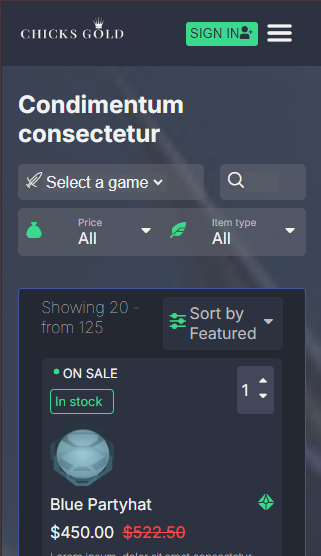
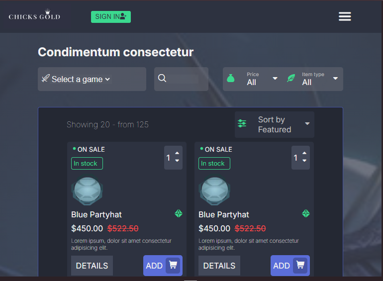
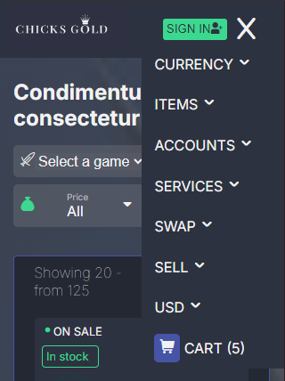
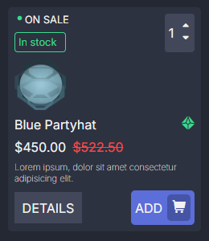
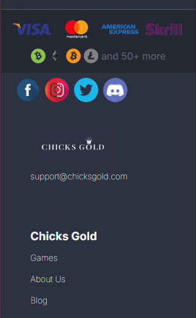

# chicksgold-challenge

En este proyecto de CHICKS GOLD [Challenge](https://chicksgold-challenge.vercel.app/), es la maquetación de la imagen que hay que recrear, siguiendo las consignas.
Está realizado en Next.js y CSS.  
El proyecto es responsive, siguendo la modalidad mobile first.
Cumple con las indicaciones de realizarlo sin que sea funcional. Por esta razon, se encontraran varios elementos que no son funcionales pero que cumplen con lo visual.

## Vista desde el celular

## Vista desde tablet (768px) 

## Vista en desktop (1440px) 

## Navbar 
El navbar está compuesto por el logo de Chicks Gold, el botón "SIGN IN" y el icono de menu hamburguesa. Al hacer click sobre el se despliega el menu.

## Cards

* Al realizar la card, maquete un input numbre, solo con el numero y los iconos de las flechas. El mismo no es funcional, ya que para eso deberia utilizar javascript. 

## Footer

* El footer cuenta con los logos y la informacion de sobre la empresa. 

